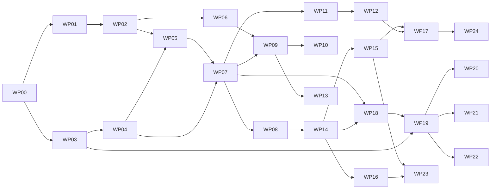

# FaBDraftSimulator: Technical Plan and Work Breakdown

**Project:** Flesh and Blood TCG Draft Simulator for *Usurp the Shadow Throne* (set code **IAR**)
**Document version:** 1.0
**Date:** 2026-09-14
**Audience:** Sonnet 5 implementation agents (autonomous or semi-autonomous coding agents)
**Status:** Ready for Phase 0 execution. Sections marked `VERIFY` must be resolved before the affected work package is marked done.

---

## 0. How agents must use this document

1. Read Sections 1 to 11 fully before touching code. They define contracts. Sections 12 onward are the executable work breakdown.
2. Pick up work packages (WPs) only when every dependency listed in its row is marked `DONE` in `docs/status/INDEX.md`.
3. Never invent card data, card text, rarities, or pack distribution numbers. If data is missing, fail loudly (`DataIncompleteError`) and escalate by writing to `docs/status/BLOCKED.md`. Fabricated card data silently destroys the training value of this tool and is the single highest-severity defect class in this project.
4. Every rule implemented in code carries a source comment in the form `# TRP 8.2.1` or `# TRP A.3` or `# CR 2.x`. No rule logic without a citation comment.
5. When a fact in Section 2 is tagged `VERIFY`, treat the stated value as a configurable default, not a constant. Put it in `data/config/*.json`, not in code.
6. Definition of Done for every WP is in Section 15. CI gates in Section 14 are non-negotiable.

---

## 1. Objective and scope

### 1.1 Objective

Build a training simulator for *Usurp the Shadow Throne* booster draft as run at Professional Rules Enforcement Level (a "called draft"), covering the flow from pack opening through to a registered, validated 30-card limited deck. Two modes:

- **Human vs Model:** one human seat, seven model/bot seats, in an 8-player pod.
- **Model vs Model:** all eight seats driven by models or heuristic bots, runnable headless and in batch for data generation and benchmarking.

Training goals the product must serve:

- Card familiarity for IAR (recognition, text recall, role in the format).
- Pick quality (signal reading, hero commitment timing, curve and pitch discipline).
- Deck construction quality (exactly 30 cards, blocks, equipment, blood debt management).

### 1.2 In scope

Draft rules and procedure (including called-draft timing), pack generation, the drafting loop, deck construction and validation, GUI, per-pick decision logs, decklist and pool file exports, post-draft analysis and coaching diff.

### 1.3 Out of scope

Playing Flesh and Blood matches. No game engine, no combat, no turn structure, no card ability resolution. Card abilities are treated as **text and metadata only**. Do not build a rules engine for gameplay; do not model the stack, layers, or arena state. Anything that requires resolving a card's effect is out of scope.

Also out of scope: multiplayer networking between multiple human users, accounts/auth, monetization, mobile-native apps, non-IAR sets (the architecture must not hardcode IAR, but only IAR ships).

---

## 2. Grounded domain facts (verification ledger)

Primary sources:

- Tournament Rules and Policy, Section 8 Limited Formats: https://rules.fabtcg.com/en/trp/08-limited-formats/
- Tournament Rules and Policy, Appendix (A.3 time limits, A.5 registration, A.7 set-specific limited rules): https://rules.fabtcg.com/en/trp/appendix/
- Draft procedure guide article: https://fabtcg.com/articles/draft-procedure-rules-guide/ (note: fabtcg.com blocks automated fetching; a human must retrieve this and paste relevant text into `docs/sources/`)
- IAR product page: https://fabtcg.com/products/booster-set/iar/
- IAR limited rules article: https://fabtcg.com/articles/rules-reprise-usurp-the-shadow-throne-limited/
- IAR release notes: https://fabtcg.com/rules-and-policy-center/release-notes/usurp-the-shadow-throne/
- Card data: https://fabrary.net/usurp-the-shadow-throne and https://cardvault.fabtcg.com/results?set_code=IAR
- Open card dataset: https://github.com/the-fab-cube/flesh-and-blood-cards

### 2.1 Draft procedure (TRP 8.2, 8.2.1)

| # | Fact | Value | Status |
|---|---|---|---|
| D1 | Pod size | 8 players, seated in a circle | VERIFIED (TRP 8.2) |
| D2 | Packs per player | 3 | VERIFIED (TRP 8.2) |
| D3 | Pick and pass | Draft 1 card, place face down in a single pile, **shuffle the remaining cards**, pass | VERIFIED (TRP 8.2.1) |
| D4 | Pass direction | Pack 1 left, pack 2 right, pack 3 left | VERIFIED (TRP 8.2.1) |
| D5 | Non-draftable cards | Basic-rarity and extra cards are removed from the pack before drafting | VERIFIED (TRP 8.2.1) |
| D6 | Pool visibility during drafting | Players may **not** look at their face-down drafted pile while drafting is in progress | VERIFIED (TRP 8.2.1) |
| D7 | Review period | Between packs, players may review everything drafted so far; recommended 1 minute | VERIFIED (TRP 8.2.1, A.3) |
| D8 | Information | No communication, no notes, no seeking information about other players' packs or picks | VERIFIED (TRP 8.2.1) |
| D9 | Pick finality | Once placed face down, the pick is final and cannot be swapped | VERIFIED (TRP 8.2.1) |
| D10 | Called draft | At Professional REL all booster drafts are called (timed and synchronized by a draft caller) | VERIFIED (TRP 8.2.1) |
| D11 | DFC handling | If the product has double-faced cards, a DFC must be placed under another card in the face-down pile, and its presence is hidden information | VERIFIED (TRP 8.2.1); whether IAR contains DFCs is `VERIFY` |
| D12 | Registration | Required for Limited at Professional REL; drafted pool registered per 8.2.2 (or self-registration 8.2.3) | VERIFIED (TRP A.5, 8.2.2) |

### 2.2 Called-draft timing (TRP A.3)

Timer is a function of the number of cards currently in the pack.

| Cards in pack | Seconds |
|---|---|
| 15, 14, 13, 12 | 50 |
| 11, 10 | 40 |
| 9, 8 | 30 |
| 7, 6 | 20 |
| 5, 4 | 10 |
| 3, 2 | 5 |
| 1 | no timer |

Also: review period 1 minute; draft deck registration 15 minutes; draft deck verification 5 minutes; draft deck build and preparation 10 minutes. The timer for the next pick starts when the caller announces that players may pick up the pack; the caller may advance early if all players have picked.

Derived check for an IAR pod (packs start at 14 draftable cards): one pack round is 50+50+50+40+40+30+30+20+20+10+10+5+5+0 = **360 seconds**; three rounds plus two 1-minute reviews is about 20 minutes, inside the 30-minute draft procedure allowance. Use this as an integration test assertion.

### 2.3 Limited deck construction (TRP 8.2, A.7)

| # | Fact | Value | Status |
|---|---|---|---|
| L1 | Card pool | The limited cards drafted, plus **any number** of basic-rarity cards from the set (basics need not be opened or drafted) | VERIFIED (TRP 8.2) |
| L2 | Hero | Exactly 1 young hero from the set; must be registered before end of deck construction and kept for the whole format | VERIFIED (TRP 8.2) |
| L3 | Legality filter | Pool is subject to the hero's class and/or talents, keywords, and format-specific restrictions | VERIFIED (TRP 8.2) |
| L4 | Copies | Any number of copies of each unique card | VERIFIED (TRP 8.2) |
| L5 | Deck size | Exactly **30** cards start the game in the deck | VERIFIED (TRP 8.2; A.7 rows for current sets) |
| L6 | Extra cards | Not part of the limited pool | VERIFIED (TRP 8.2, A.7) |
| L7 | IAR-specific limited rule (e.g. a starting macro/token) | Unknown; A.7 lists set-specific rules for some sets (Rosetta, High Seas, Omens of the Third Age). IAR may add one | `VERIFY` |

Arena cards (hero, weapons, equipment) are registered separately from the 30 deck cards. Weapon and equipment slot constraints (one equipment per body slot: head, chest, arms, legs; hands available for weapons) must be confirmed against the Comprehensive Rules before WP-06 is closed: `VERIFY (CR)`.

### 2.4 Usurp the Shadow Throne (IAR) set and product facts

| # | Fact | Value | Status |
|---|---|---|---|
| S1 | Set code / number | IAR, 20th booster set | VERIFIED |
| S2 | Release | 2026-09-25 (pre-release 2026-09-18 to 09-24) | VERIFIED |
| S3 | Set size | 263 cards | VERIFIED |
| S4 | Rarity split | 2 Fabled, 27 Marvel, 5 Legendary, 40 Majestic (20 core + 20 expansion), 66 Rare, 133 Common, 16 Basic | VERIFIED |
| S5 | Pack size | 16 cards | VERIFIED |
| S6 | Display / case | 24 packs per display, 4 displays per case (an 8-player pod consumes exactly one display) | VERIFIED |
| S7 | Pack slots | 11 Common; 2 Rare-or-Majestic (1 Rare + 1 Rare-or-Majestic); 1 Rainbow Foil; 2 Basic (1 Basic + 1 of Basic / Expansion Slot / Legendary / Cold Foil / Marvel / Fabled) | VERIFIED (published distribution) |
| S8 | Cold foil rate | 1 per 24 packs, replacing a Basic | VERIFIED |
| S9 | Draftable cards per pack | **14** (the 11 commons, the 2 rare/majestic, the rainbow foil). The 2 basic-slot cards are the non-draftable extras | DERIVED from S7 + TRP A.7 (14 to 15 draftable, 1 to 2 extras). Confirm against the official IAR limited article: `VERIFY` |
| S10 | Limited heroes | Three Shadow heroes: **Levia** (Brute), **Malice** (Necromancer), **Viserai, Between Worlds** (Runeblade). Each has a basic-rarity weapon **and** a basic-rarity arm equipment, so heroes/weapons/arms do not need to be drafted or opened | VERIFIED (official IAR limited article) |
| S11 | Pre-release-only hero | *Baalghor, Omen of the End* is playable at pre-release only if opened in a pre-release kit. Not legal for this simulator's default (draft) configuration | VERIFIED; expose as config flag `allow_prerelease_hero: false` |
| S12 | Key mechanics present in card text | Blood Debt (lose 1 life at the beginning of your end phase per face-up card with blood debt in your banished zone), Gate to i'Arathael tokens (play cards from the banished zone), usurp (seizing opponents' Runechants), banished-zone play | VERIFIED as text-level facts; no gameplay implementation required |
| S13 | Expansion-slot majestics | The 20 expansion majestics appear in the extra slot, therefore are not draftable | DERIVED from S7. `VERIFY` |
| S14 | Rainbow foil slot rarity mix | Unknown distribution across Common/Rare/Majestic | `VERIFY`; ship as configurable weights, default documented as ESTIMATED |
| S15 | Rare-or-Majestic slot majestic rate | Unknown | `VERIFY`; default 0.5 in config, flagged ESTIMATED |

**Derived pod arithmetic (use as invariants):** 8 seats x 3 packs = 24 packs; 24 x 14 draftable = 336 cards drafted; 336 / 8 = **42 cards per player**; each seat makes 14 picks per pack round from pack sizes 14 down to 1.

### 2.5 Data availability risk (read before Phase 0)

IAR releases 2026-09-25. As of this document's date the full, correct card list may not be published in machine-readable form. Community datasets typically complete around or shortly after release, and previews are partial. Therefore:

- WP-01 delivers an **ingestion pipeline plus a synthetic fixture set** (`FIXTURE` set code) with the same shape and counts as IAR, so every downstream WP can proceed without real card data.
- A hard validation gate (WP-02) refuses to load a set unless counts match S3/S4 exactly, or the operator explicitly passes `--allow-incomplete` (which stamps every export and log with `data_integrity: incomplete`).

---

## 3. Product behaviour specification

### 3.1 Session flow

```
NEW SESSION
  -> configure (seed, seat count, seat agents, timers on/off, rules-accurate pool hiding, model config)
  -> DRAFT: for round in 1..3:
        open pack (16 cards) -> remove 2 extras (logged, shown once) -> 14 draftable
        for pick in 1..14:
            all seats pick simultaneously within the timer window
            picks are placed face down; remaining cards shuffled; packs passed (L, R, L)
        REVIEW window (default 60s, human may skip)
  -> POOL COMPLETE (42 cards + all IAR basics available)
  -> REGISTRATION (optional, simulates TRP 8.2.2/8.2.3; off by default, on in "full procedure" mode)
  -> DECK BUILD (default 10 minute timer, skippable): choose hero, arena cards, exactly 30 deck cards
  -> VALIDATION: legality + exactly-30 gate
  -> REPORT: logs, coach diff, pool analysis, exports
```

### 3.2 Rules-accurate information handling (critical)

The default configuration must reproduce the information constraints of a real called draft. This is a training tool; leaking information trains the wrong instincts.

| Information | Human seat | Model seat |
|---|---|---|
| Current pack contents | Visible | Provided |
| Own drafted pool during a pack round | **Hidden** (D6) | **Not provided** |
| Own drafted pool during review window and after | Visible | Provided at review and at the start of the next round |
| Own picks earlier in the current pack round | Hidden during picking (no notes, D8) | Not provided; configurable `memory_policy` (see 8.3) |
| Other seats' pools, picks, or packs | Never | Never |
| Cards removed as extras from own packs | Shown at open (they are physically seen) | Provided for own packs only |
| Contents of packs seen earlier this round | Not displayed; `casual_mode` may enable a "seen cards" panel | `memory_policy` controls |

`casual_mode: true` relaxes D6 and D8 for beginners (pool always visible, seen-packs panel). It must be recorded in the log header and stamped on exports, because pick quality is not comparable across modes.

### 3.3 Timeouts

When a seat's timer expires: the engine performs an auto-pick using the seat's configured `timeout_policy` (`random` | `heuristic_best`, default `heuristic_best` for bots, `random` for human seats so that the human feels the cost), marks the pick `timed_out: true`, and increments a session counter surfaced in the report. No penalties are simulated beyond logging.

---

## 4. Architecture

### 4.1 Principles

1. **Event-sourced core.** The draft is an append-only event log; all state is a pure fold over events. This buys replay, deterministic tests, logs, and a trivial "undo for review" path for free.
2. **Pure, deterministic, offline core.** `core` imports no network client, reads no environment variables, and performs no I/O except through injected ports. All randomness flows from one injected seeded RNG.
3. **Contract-first.** JSON Schemas in `contracts/` are the source of truth for every cross-package payload. Generated Python (pydantic) and TypeScript types; no hand-written duplicates.
4. **Agents are plugins.** Human, heuristic, and LLM agents implement one interface. The engine cannot tell them apart and never passes them information outside the agent view.
5. **Fail loud on data.** Missing or inconsistent card data raises; it never degrades into guesses.

### 4.2 Recommended stack

| Layer | Choice | Rationale |
|---|---|---|
| Core engine | Python 3.12, pydantic v2, no framework | Agent-friendly, strong typing, easy property testing with Hypothesis |
| Agents | Python; LLM agent uses the Anthropic Messages API with a tool-use schema for structured picks | Structured output, retries, cheap swap between models |
| API | FastAPI + WebSocket (`/ws/session/{id}`) | Push timer ticks and pack state; simple REST for session setup and exports |
| Frontend | React 18 + TypeScript + Vite + Tailwind; Zustand for state | Card-grid UI with images, keyboard-first picking |
| Persistence | SQLite via `sqlite3` for session index; JSONL files for event logs; filesystem for exports | No server dependency; logs are the product |
| CLI | Typer (`fabdraft`) | Headless model-vs-model batch runs |
| Tests | pytest, Hypothesis, pytest-cov; Vitest + Playwright for the web app | Golden-file replay tests are the backbone |

Deviations from this stack require a note in `docs/decisions/ADR-XXX.md` and must preserve the package boundaries in 4.3.

### 4.3 Repository layout

```
fabdraftsim/
  contracts/                 # JSON Schemas, single source of truth (versioned)
    card.schema.json
    set.schema.json
    pack_config.schema.json
    draft_event.schema.json
    agent_view.schema.json
    pick_decision.schema.json
    decklist.schema.json
    session_config.schema.json
  packages/
    core/                    # pure engine, no network, no I/O
      fabdraft_core/
        cards/               # Card, CardSet, indexes, legality
        packs/               # pack generator
        draft/               # state machine, events, timers, pod topology
        deck/                # pool view, deck builder validation, metrics
        logs/                # event -> JSONL, event -> markdown
        rng.py               # SeededRng, the only randomness source
        errors.py
      tests/
    agents/
      fabdraft_agents/
        base.py              # Agent protocol
        human.py             # queue-backed, driven by API/UI
        heuristic.py         # deterministic, no network, used in CI
        llm.py               # Anthropic tool-use agent
        prompts/             # versioned prompt templates
      tests/
    exports/                 # decklist + pool writers (json, txt, csv, md)
  apps/
    api/                     # FastAPI app, session manager, WS transport
    web/                     # React app
    cli/                     # fabdraft CLI (single draft, batch sim, replay)
  data/
    sets/                    # ingested set snapshots (gitignored if licensed art/text)
    config/
      iar.pack_config.json
      iar.format.json        # heroes, basics, format-specific restrictions
    fixtures/
      fixture_set.json       # synthetic 263-card stand-in
      golden/                # golden draft replays
  docs/
    sources/                 # pasted rules excerpts with retrieval dates
    decisions/               # ADRs
    status/                  # INDEX.md, WP-XX.md handoffs, BLOCKED.md
  scripts/
    ingest_set.py
    validate_set.py
    fetch_images.py
```

---

## 5. Data contracts

Schemas live in `contracts/`. Below are the required fields; agents may add optional fields but must not rename or remove.

### 5.1 Card

A "unique card" is `name + pitch` (matching the convention of the open dataset). Printings are collapsed; foiling is a property of the drafted instance, not the card.

```json
{
  "uid": "IAR166-red",
  "set_code": "IAR",
  "card_number": "IAR166",
  "name": "Open the Gate to i'Arathael",
  "pitch": 1,
  "rarity": "M",
  "types": ["Action", "Attack"],
  "classes": ["Runeblade"],
  "talents": ["Shadow"],
  "subtypes": ["Attack"],
  "cost": 0,
  "power": 4,
  "defense": null,
  "life": null,
  "intellect": null,
  "keywords": ["Blood Debt"],
  "functional_text": "When this hits or is banished from hand or deck, create a Gate to i'Arathael token.",
  "specialization": null,
  "is_deck_card": true,
  "is_arena_card": false,
  "equipment_slot": null,
  "hands": null,
  "image_url": "https://.../IAR166.png",
  "double_faced_with": null,
  "draftable": true,
  "data_complete": true
}
```

Rules for the ingest layer:

- `rarity` enum: `B` (Basic), `C`, `R`, `M`, `L` (Legendary), `V` (Marvel), `F` (Fabled). Map dataset values explicitly; do not guess.
- `classes: []` means Generic. `talents: []` means no talent.
- `specialization` holds the hero name when the card text contains a Specialization restriction.
- `equipment_slot` in `head|chest|arms|legs`, `hands` in `1|2` for weapons.
- `draftable` is computed by the pack/format config (Section 6.1), not read from source data.
- `data_complete: false` on any card with a missing required field; loading a set with incomplete cards requires `--allow-incomplete`.

### 5.2 Set snapshot

```json
{
  "set_code": "IAR",
  "name": "Usurp the Shadow Throne",
  "release_date": "2026-09-25",
  "source": {"provider": "the-fab-cube", "commit": "…", "retrieved_at": "…"},
  "expected_counts": {"total": 263, "F": 2, "V": 27, "L": 5, "M": 40, "R": 66, "C": 133, "B": 16},
  "cards": [ /* Card[] */ ],
  "integrity": {"counts_match": true, "incomplete_cards": []}
}
```

### 5.3 Format config (`iar.format.json`)

```json
{
  "set_code": "IAR",
  "deck_size": 30,
  "deck_size_mode": "exact",
  "heroes": [
    {"uid": "…", "name": "Levia", "classes": ["Brute"], "talents": ["Shadow"],
     "basic_weapon_uids": ["…"], "basic_equipment_uids": ["…"]},
    {"uid": "…", "name": "Malice", "classes": ["Necromancer"], "talents": ["Shadow"], "…": "…"},
    {"uid": "…", "name": "Viserai, Between Worlds", "classes": ["Runeblade"], "talents": ["Shadow"], "…": "…"}
  ],
  "basic_pool_unlimited": true,
  "allow_prerelease_hero": false,
  "format_restrictions": [],
  "notes": "format_restrictions carries any IAR-specific limited rule from TRP A.7 once published (VERIFY L7)."
}
```

Heroes, weapons, and basics must be **derived from the loaded set data** by rarity and type, then cross-checked against this file. If the derivation and the file disagree, raise.

### 5.4 Pack config (`iar.pack_config.json`)

```json
{
  "set_code": "IAR",
  "pack_size": 16,
  "slots": [
    {"id": "common", "count": 11, "rarities": {"C": 1.0}, "draftable": true},
    {"id": "rare", "count": 1, "rarities": {"R": 1.0}, "draftable": true},
    {"id": "rare_or_majestic", "count": 1, "rarities": {"R": 0.5, "M": 0.5},
     "majestic_subset": "core", "draftable": true, "confidence": "ESTIMATED"},
    {"id": "rainbow_foil", "count": 1, "rarities": {"C": 0.75, "R": 0.20, "M": 0.05},
     "foiling": "RF", "draftable": true, "confidence": "ESTIMATED"},
    {"id": "basic", "count": 1, "rarities": {"B": 1.0}, "draftable": false},
    {"id": "chase", "count": 1,
     "rarities": {"B": 0.62, "M_expansion": 0.20, "L": 0.08, "V": 0.07, "F": 0.01, "CF": 0.02},
     "draftable": false, "confidence": "ESTIMATED"}
  ],
  "no_duplicate_uids_within_pack": true,
  "cold_foil_rate_per_pack": 0.0417
}
```

Every `ESTIMATED` weight must be surfaced in the UI "about this simulation" panel and in the log header. Only `pack_size`, slot identities, counts, and `draftable` flags are treated as VERIFIED.

### 5.5 Draft event (append-only)

```json
{
  "event_id": 128,
  "session_id": "…",
  "ts_sim_ms": 372500,
  "ts_wall": "2026-09-14T18:02:11Z",
  "type": "PICK_MADE",
  "round": 2,
  "pick_number": 5,
  "seat": 3,
  "payload": {
    "pack_id": "r2p6",
    "pack_size_before": 10,
    "offered_uids": ["…"],
    "picked_uid": "…",
    "time_used_ms": 21430,
    "timed_out": false,
    "agent": {"kind": "llm", "model": "…", "prompt_version": "v3"},
    "decision": {"reasoning": "…", "hero_lean": "Malice", "confidence": 0.72,
                 "ranked_alternatives": [{"uid": "…", "score": 0.61}]}
  }
}
```

Event types (minimum): `SESSION_CREATED`, `SEED_SET`, `POD_SEATED`, `PACK_OPENED`, `EXTRAS_REMOVED`, `PACK_PRESENTED`, `PICK_WINDOW_OPENED`, `PICK_MADE`, `PICK_AUTO`, `PACK_SHUFFLED`, `PACK_PASSED`, `ROUND_COMPLETE`, `REVIEW_OPENED`, `REVIEW_CLOSED`, `POOL_FINALIZED`, `HERO_SELECTED`, `DECK_CARD_ADDED`, `DECK_CARD_REMOVED`, `DECK_SUBMITTED`, `VALIDATION_RESULT`, `EXPORT_WRITTEN`, `SESSION_ENDED`.

### 5.6 Agent view (the only thing an agent receives)

```json
{
  "schema_version": "1.0",
  "seat": 3,
  "pod_size": 8,
  "round": 2,
  "pick_number": 5,
  "picks_remaining_in_round": 10,
  "pass_direction": "right",
  "time_limit_ms": 40000,
  "pack": [ /* Card[] with draftable=true */ ],
  "own_pool": [ /* Card[] or [] when hidden by information policy */ ],
  "own_pool_visible": false,
  "memory": {"seen_packs": [], "own_picks_this_round": []},
  "format": {"deck_size": 30, "heroes": [ /* hero summaries */ ], "basics_available": true},
  "notes": "no other-seat information is ever present in this object"
}
```

A schema test must assert the agent view has no field that can carry another seat's identity, pool, or pick.

---

## 6. Core algorithms

### 6.1 Pack generation

```
generate_pack(set, pack_config, rng) -> Pack:
  pool_by_rarity = index(set.cards, rarity, excluding heroes/tokens per format config)
  picked = []
  for slot in pack_config.slots (in declared order):
      for i in 1..slot.count:
          rarity = rng.weighted_choice(slot.rarities)
          candidates = pool_by_rarity[rarity] filtered by slot constraints
                       (majestic_subset=core -> exclude expansion majestics)
                       minus picked uids if no_duplicate_uids_within_pack
          if candidates empty: raise PackGenerationError (never silently relax)
          card = rng.choice(candidates)
          picked.append(instance(card, foiling=slot.foiling, slot_id=slot.id,
                                 draftable=slot.draftable))
  assert len(picked) == pack_config.pack_size
  return Pack(cards=picked, draftable=[c for c in picked if c.draftable])
```

Requirements:

- Slot order is the physical pack order; the first 14 are draftable, the last 2 are extras (S9). Preserve order in the log so that pack contents are reproducible.
- Uniform sampling within a rarity is the default model. It is an approximation of print sheets; document it as such in the about panel.
- `rng` is a `SeededRng` derived as `rng_for(seed, "pack", round, pack_index)` so that pack contents are stable regardless of agent timing or turn order.

### 6.2 Draft state machine

Pod topology: seats `0..7`. `pass_direction` per round from D4: round 1 left (`seat+1 mod 8`), round 2 right (`seat-1 mod 8`), round 3 left.

```
for round in 1..3:
    for seat in seats: pack[seat] = generate_pack(...)         # PACK_OPENED
    for seat in seats: extras = pack[seat].remove_extras()     # EXTRAS_REMOVED (own view only)
    for pick_number in 1..14:
        for seat: PICK_WINDOW_OPENED (time_limit = timer_for(pack_size))
        gather picks concurrently (async); on expiry auto-pick
        for seat: PICK_MADE / PICK_AUTO, card moves to face-down pool
        for seat: pack.shuffle(rng_for(seed,"shuffle",round,pick,seat))   # D3, PACK_SHUFFLED
        rotate packs by pass_direction                                   # PACK_PASSED
    ROUND_COMPLETE; REVIEW_OPENED (60s or skip); REVIEW_CLOSED
POOL_FINALIZED
```

Invariants (assert in code, not only in tests):

- Every draftable card is picked exactly once; `sum(len(pool[s])) == 336` at `POOL_FINALIZED`; `len(pool[s]) == 42` for all seats.
- A seat never receives the same pack twice within a round.
- Pack sizes seen by each seat within a round are exactly `{14,13,...,1}`.
- No event ever contains another seat's pool.

Concurrency: the engine drives agents with `asyncio.gather` under a per-seat timeout. Human seats resolve via an `asyncio.Queue` fed by the API. Simulated time must be decoupled from wall time so that headless batch runs execute instantly (`clock: SimClock | RealClock`).

### 6.3 Deck legality

```
def card_playable_by(card, hero, format_config) -> bool:
    if card.rarity == "B" and not format_config.basic_pool_unlimited: ...
    if not set(card.classes) <= set(hero.classes): return False       # Generic passes (empty set)
    if not set(card.talents) <= set(hero.talents): return False
    if card.specialization and card.specialization != hero.name: return False
    if card.uid in format_config.banned_in_limited: return False
    return True
```

This subset rule is why Levia (Shadow Brute) may play a non-Shadow Brute card and a Shadow card with no class, but not a Chaos Brute card. Add the `# CR` citation once the exact section is confirmed, and add a unit test per hero with hand-checked examples in `tests/data/legality_cases.json`.

Deck submission validation returns a list of coded violations:

| Code | Meaning |
|---|---|
| `DECK_SIZE` | deck-card count != 30 |
| `ILLEGAL_CARD` | fails `card_playable_by` |
| `NOT_IN_POOL` | card is neither drafted nor basic-rarity |
| `NO_HERO` | hero not selected |
| `HERO_NOT_YOUNG` | hero is not a young hero from the set |
| `EQUIP_SLOT_CONFLICT` | more than one equipment in a body slot |
| `WEAPON_HANDS` | weapon configuration exceeds available hands |
| `ARENA_CARD_IN_DECK` | arena card counted among the 30 |
| `FORMAT_RESTRICTION` | violates a set-specific limited rule (L7) |

### 6.4 Pool and deck metrics (training signal)

Computed for the report and for the deck-build assistant. Pure functions over `(pool, hero, deck)`:

- Playable count per candidate hero (drives the "which hero was your pool actually best for" panel).
- Pitch distribution (1/2/3), target band configurable, default flagged as heuristic guidance not rules.
- Attack action count, average power, cost curve histogram.
- Defence profile: count of cards with defence 3, average defence, number of blue blocks.
- Go again density, arcane sources, equipment coverage by slot.
- IAR-specific: blood debt card count, Gate to i'Arathael generators, banished-zone payoffs, usurp enablers, Runechant generators. These are derived by keyword and text matching over `functional_text`; matchers live in `core/deck/iar_tags.py` with a test per tag and a documented false-positive rate.

No metric is presented as an authoritative rating. The UI labels them "pool shape", not "score".

---

## 7. Logging specification

Three artefacts per session, written under `runs/{session_id}/`:

1. `events.jsonl` - the complete event log (Section 5.5). Append-only, one JSON object per line, schema-validated in CI.
2. `draft_log.md` - human-readable narrative: session header (seed, seat configuration, model ids, prompt versions, casual mode, data integrity, estimated pack weights), then per pick: round/pick, pack size, cards offered (name, pitch, rarity, cost/power/defence), pick made, time used, timeout flag, and for model seats the recorded reasoning and alternatives. Then the review notes, deck build actions, validation result, and final decklist.
3. `session.json` - metadata index for search: seed, timestamps, seat agents, per-seat hero, deck validity, counts, cost/token usage for LLM seats.

Requirements:

- The log must be sufficient to **replay the session bit-for-bit** with `fabdraft replay runs/{id}` (golden test in WP-04).
- Redaction: reasoning text from model seats is included by default; `--no-reasoning` omits it. Never log API keys.
- Logs are the primary training artefact. A missing field in the log is treated as a functional bug, not a cosmetic one.

---

## 8. Agents

### 8.1 Interface

```python
class Agent(Protocol):
    kind: Literal["human", "heuristic", "llm"]
    async def pick(self, view: AgentView, deadline_ms: int) -> PickDecision: ...
    async def review(self, view: ReviewView) -> None: ...          # optional memory update
    async def build_deck(self, view: DeckBuildView) -> DeckSubmission: ...
```

`PickDecision`: `{picked_uid, reasoning?, hero_lean?, confidence?, ranked_alternatives?}`. The engine rejects a decision whose `picked_uid` is not in the presented pack and treats rejection as a timeout (logged `PICK_AUTO` with `reason: invalid_decision`).

### 8.2 Heuristic agent (required, used by CI)

Deterministic, no network, fast. Purpose: make every test and batch run possible without model cost, and provide the `heuristic_best` timeout policy.

Design: a transparent, weighted linear evaluator over card features with a hero-commitment state machine:

- Base value by rarity and by role (attack action, defence-heavy blue, equipment, weapon).
- Class/talent fit multiplier against current hero lean, where lean is a softmax over accumulated class weight in the pool.
- Curve and pitch pressure terms (penalise over-concentration).
- Tag bonuses for IAR synergies (blood debt mitigation, Gate generators when banished-zone payoffs are already in the pool).
- Tie-break by `uid` for determinism.

All weights in `data/config/heuristic_weights.json`. The agent must expose `explain(view)` returning per-candidate term breakdowns so it can serve as the baseline in the coach diff.

### 8.3 LLM agent

- Transport: Anthropic Messages API, tool `submit_pick` with a JSON schema mirroring `PickDecision`; `tool_choice` forces the tool so output is always structured.
- Prompt (versioned in `agents/prompts/pick.vN.md`) contains: format rules summary, seat and pass direction, pick number and picks remaining, rendered pack (compact one-line-per-card with all mechanically relevant fields), own pool grouped by class/pitch when visible, hero lean so far, and an explicit instruction to name the pick by `uid`.
- `memory_policy`: `none` (each pick independent), `own_pool` (default: own picks carried forward, matching what a real player remembers), `full_recall` (also all packs seen this round; a deliberately superhuman setting for research, must be stamped in the log).
- Reliability: per-call timeout below the draft timer, up to 2 retries with jitter, then fall back to the heuristic agent (logged `fallback_used: true`).
- Cost control: response caching keyed by `sha256(prompt)`, configurable model per seat (mix cheap and expensive models across seats), token and cost accounting per session, hard `max_cost_usd` guard that fails the run rather than silently switching models.
- Determinism: `temperature` default 0.0 and recorded; model responses are cached into the golden fixtures so CI never calls the API.

### 8.4 Human agent

Queue-backed adapter. Receives the same `AgentView` the models get (minus model-only fields), so the UI physically cannot show the human information the rules forbid. The information policy is enforced in `core`, not in the frontend.

---

## 9. GUI specification

### 9.1 Screens

1. **Home / New draft.** Seed (blank = random, shown after creation), pod size (default 8), per-seat agent picker (human/heuristic/model + model id), timers on/off, casual mode, full-procedure mode (registration + deck-build timers), data integrity banner if the set snapshot is incomplete.
2. **Draft table.** Centre: the current pack as a responsive card grid (card images with a text-only toggle). Top: round and pick counters, pass direction indicator, countdown ring with the A.3 value, pod diagram showing seats and pass direction (no opponent information beyond seat identity). Right rail: hero lean helper (optional, casual mode only), and a locked "pool hidden during pack" notice in rules-accurate mode. Bottom: pick history for the current pack only when casual mode is on.
3. **Review (between packs).** Full pool, grouped by class/talent then pitch, with the pool metrics panel. 60-second default timer with skip.
4. **Deck build.** Hero selector (3 IAR heroes, with each hero's basic weapon and arm equipment auto-attached), pool on the left with filters (class, talent, pitch, type, cost, tag), deck on the right with a live count against 30 and a prominent validity chip, equipment slot tray, one-click "add all legal basics" helper, validation panel listing violation codes with plain-language explanations.
5. **Report.** Timeline of picks with the pack that was offered; coach diff (your pick vs baseline agent pick, with the baseline's term breakdown and, for model seats, their recorded reasoning); pool shape charts; export buttons.
6. **Replay viewer.** Load `runs/{id}` and step through pick by pick, including other seats' picks (post-hoc disclosure is legitimate and is the main learning surface).

### 9.2 Interaction requirements

- Keyboard first: number keys select, arrow keys move focus, Enter confirms, Space toggles zoom. A pick must be confirmable in one keystroke plus Enter to be usable inside a 5-second timer.
- Card zoom on hover/long-press with full text.
- Timer must never block the UI thread; drift under 100 ms per pick against the server clock.
- Card images: loaded from official URLs recorded in the set snapshot, cached locally by `scripts/fetch_images.py` into a gitignored directory. Text-only mode must be fully functional with no images present.
- Responsive to 1280x720 minimum; no mobile-native requirement.

### 9.3 Accessibility and polish

Contrast AA, focus rings, no colour-only encoding (pitch shown as number plus colour), reduced-motion honoured, all timers announced to screen readers at 10/5/3 seconds.

---

## 10. Exports

Written to `runs/{session_id}/exports/seat_{n}/`:

| File | Content |
|---|---|
| `decklist.json` | Canonical: hero, arena cards, 30 deck cards with uid/name/pitch/quantity, pool, session metadata, validation result |
| `decklist.txt` | Registration-sheet order per TRP A.5 Limited: hero line, arena cards, then deck cards grouped as pitch 1/none, pitch 2, pitch 3, each line `Qty  Name (pitch)` |
| `pool.csv` | Full 42-card drafted pool plus available basics: `uid,name,pitch,rarity,classes,talents,types,cost,power,defense,drafted_round,drafted_pick` |
| `registration_sheet.md` | Printable approximation of the official limited registration sheet, ordered per A.5 |
| `draft_log.md`, `events.jsonl` | Copies or relative links to the session logs |

Interoperability with third-party deck builders (Fabrary and similar) is **best-effort**: implement `decklist.txt` as the lowest-common-denominator name+pitch list, verify a manual import once, and record the result in `docs/status/WP-13.md`. Do not claim compatibility that has not been manually verified.

---

## 11. Non-functional requirements

| Area | Requirement |
|---|---|
| Determinism | Same seed + same agent configuration + cached model responses = byte-identical `events.jsonl` |
| Performance | Headless model-vs-model draft with heuristic agents: under 2 seconds end to end. Pack generation: 1000 packs under 1 second. UI pick-to-render under 100 ms |
| Batch | `fabdraft sim --seeds 1..500` runs with heuristic agents on one core without exhausting memory (stream logs, do not accumulate) |
| Offline | Everything except LLM seats and first-time image fetch works with no network |
| Cost | LLM cost per 8-seat all-model draft estimated and reported; 336 pick calls is the baseline, so caching and model mixing are mandatory |
| Data integrity | Any export produced from an incomplete set snapshot carries `data_integrity: incomplete` in file and UI |
| IP | Card names, text, and images are Legend Story Studios property. Do not commit card text dumps or images to the repository. Fetch at setup time from the configured source, keep under `data/` (gitignored), and render an attribution and non-affiliation notice in the UI and README. Do not scrape sites that block automated access; fabtcg.com blocks bots, so rules excerpts must be added by a human into `docs/sources/` with retrieval dates |

---

## 12. Work breakdown

Sizes: S = under 200 lines of production code, M = 200 to 600, L = 600 plus. "Owner" is a role label for parallel agent assignment, not a person.

### Phase 0: Foundations

| WP | Title | Depends | Size | Deliverables | Acceptance criteria |
|---|---|---|---|---|---|
| WP-00 | Repo, tooling, CI | - | S | Layout per 4.3, `pyproject.toml`, ruff + mypy strict, pytest, pre-commit, GitHub Actions running lint/type/test, `docs/status/INDEX.md` with all WP rows | CI green on an empty test suite; `mypy --strict packages/core` passes; `docs/status/INDEX.md` lists every WP with status |
| WP-01 | Set ingestion + fixture set | WP-00 | M | `scripts/ingest_set.py` (source: the-fab-cube dataset, pinned commit), `contracts/card.schema.json`, `contracts/set.schema.json`, `data/fixtures/fixture_set.json` (263 synthetic cards matching S4 counts, 3 fixture heroes, 16 fixture basics) | Ingesting the pinned dataset produces a schema-valid snapshot; fixture set loads and passes all integrity checks; zero hand-typed card text in the repo |
| WP-02 | Set validation gate | WP-01 | S | `scripts/validate_set.py`, `core/cards/integrity.py` | Refuses a snapshot whose rarity counts differ from `expected_counts` (S3/S4); `--allow-incomplete` stamps `data_integrity: incomplete`; unit tests for each failure mode |
| WP-03 | Contracts + codegen | WP-00 | M | All schemas in `contracts/`, pydantic models generated for Python, TS types generated for the web app, `make contracts` | Generated types compile on both sides; a schema change without regeneration fails CI |

### Phase 1: Core engine

| WP | Title | Depends | Size | Deliverables | Acceptance criteria |
|---|---|---|---|---|---|
| WP-04 | Seeded RNG + event store | WP-03 | S | `core/rng.py` (`rng_for(seed, *path)`), `core/draft/events.py`, JSONL writer/reader, fold-based state reconstruction | Property test: folding a log reproduces identical state; no module-level randomness (CI grep for `random.` / `Math.random` outside `rng.py`) |
| WP-05 | Pack generator | WP-02, WP-04 | M | `core/packs/`, `data/config/iar.pack_config.json` | Pack is exactly 16 cards with 14 draftable (S5, S9); slot rarities respected; no duplicate uids within a pack; expansion majestics never appear in draftable slots (S13); 10k-pack statistical test within tolerance of configured weights; same seed gives identical packs |
| WP-06 | Card model, indexes, legality | WP-02 | M | `core/cards/legality.py`, `tests/data/legality_cases.json` | Subset rule per 6.3 with `# CR` citations; hand-checked cases for all three IAR heroes pass, including Generic, class-only, talent-only, mismatched-talent, and Specialization cases |
| WP-07 | Draft state machine | WP-04, WP-05 | L | `core/draft/engine.py`, pod topology, timers (A.3 table), pass direction (D4), shuffle-on-pass (D3), review windows, timeout auto-pick | All invariants in 6.2 asserted; 42 cards per seat; 336 total; pack sizes per seat per round are exactly 14..1; pass direction L/R/L verified by test; simulated one-round duration equals 360 s (2.2); SimClock run of a full draft under 2 s |
| WP-08 | Information policy enforcement | WP-07 | M | `core/draft/views.py` (agent view builder), policy config | Property test over thousands of random states: no agent view contains another seat's seat id, pool, or pick; `own_pool` empty unless in a review window or `casual_mode`; violation raises rather than filters silently |
| WP-09 | Deck build + validation | WP-06, WP-07 | M | `core/deck/builder.py`, violation codes per 6.3, basics auto-availability | Exactly-30 gate; every violation code reachable and unit tested; drafted pool plus basics is the only legal source; hero's basic weapon and arm equipment auto-available (S10) |
| WP-10 | Pool and deck metrics + IAR tags | WP-09 | M | `core/deck/metrics.py`, `core/deck/iar_tags.py` | Every metric a pure function with a unit test; each IAR tag matcher has positive and negative cases; metrics never labelled as ratings |
| WP-11 | Log writers | WP-07, WP-09 | M | `core/logs/jsonl.py`, `core/logs/markdown.py`, `session.json` | `events.jsonl` validates against schema; `draft_log.md` contains every field in Section 7; golden-file test on a fixture draft |
| WP-12 | Replay | WP-11 | S | `fabdraft replay`, deterministic re-execution | Replaying a golden log reproduces byte-identical events; a deliberate engine change that breaks determinism fails the golden test |
| WP-13 | Exports | WP-09 | M | `packages/exports/` writers for all files in Section 10 | Files produced for every seat; `decklist.txt` grouped per A.5; round-trip test (`decklist.json` reload yields the same deck); manual third-party import attempt recorded in the WP handoff |

### Phase 2: Agents

| WP | Title | Depends | Size | Deliverables | Acceptance criteria |
|---|---|---|---|---|---|
| WP-14 | Agent protocol + human adapter | WP-08 | S | `agents/base.py`, `agents/human.py` | Engine cannot distinguish agent kinds; invalid decision handled as timeout with correct log reason |
| WP-15 | Heuristic agent | WP-14, WP-10 | M | `agents/heuristic.py`, `heuristic_weights.json`, `explain()` | Deterministic across runs; completes 336 picks in under 200 ms total; `explain()` returns per-term breakdowns; beats a random agent on a defined pool-quality metric across 200 seeded drafts (report the number, do not tune to a target) |
| WP-16 | LLM agent | WP-14 | L | `agents/llm.py`, versioned prompts, tool schema, cache, retries, fallback, cost accounting | Forced tool use yields schema-valid decisions; timeout below the pick timer; fallback path tested with an injected failing transport; cache hit produces zero API calls; cost guard aborts the run when exceeded; CI never calls the network (fixtures only) |
| WP-17 | CLI: single draft + batch sim | WP-12, WP-15 | M | `apps/cli` (`sim`, `replay`, `validate-set`, `fetch-images`) | `fabdraft sim --seeds 1-100 --all-heuristic` completes without network and streams logs; per-seat exports written; memory flat across seeds |

### Phase 3: Transport

| WP | Title | Depends | Size | Deliverables | Acceptance criteria |
|---|---|---|---|---|---|
| WP-18 | API + session manager | WP-07, WP-14 | L | FastAPI: `POST /sessions`, `GET /sessions/{id}`, `POST /sessions/{id}/picks`, `POST /sessions/{id}/deck`, `GET /sessions/{id}/exports/*`, `WS /ws/session/{id}` | WS pushes `PACK_PRESENTED`, timer ticks, round transitions; reconnect resumes state from the event log; human pick round-trip under 100 ms locally; API returns only policy-filtered views (test with a malicious client requesting other seats) |

### Phase 4: GUI

| WP | Title | Depends | Size | Deliverables | Acceptance criteria |
|---|---|---|---|---|---|
| WP-19 | Web app shell + state | WP-18, WP-03 | M | Vite app, routing, Zustand store, WS client, generated types, design tokens | Reconnect and resume works; no `any` types; lint and `tsc` clean |
| WP-20 | Draft table screen | WP-19 | L | Pack grid, timer ring, pod diagram, keyboard picking, card zoom, text-only mode, image cache loader | Pick in one keystroke plus Enter; timer drift under 100 ms; renders 14 cards under 100 ms; works with images absent; pool hidden in rules-accurate mode |
| WP-21 | Review + deck build screens | WP-19, WP-09 | L | Review panel with metrics; deck builder with filters, slot tray, live 30-count, validation panel | Building a legal 30-card deck from a fixture pool takes under 20 interactions; every violation code renders a plain-language message; basics helper works |
| WP-22 | Report + replay viewer | WP-19, WP-11, WP-15 | M | Timeline, coach diff, pool charts, export buttons, replay stepper | Coach diff shows baseline pick plus reasoning for every pick; replay steps through all 42 picks including opponents; exports downloadable |

### Phase 5: Training features and hardening

| WP | Title | Depends | Size | Deliverables | Acceptance criteria |
|---|---|---|---|---|---|
| WP-23 | Coach mode | WP-15, WP-16, WP-22 | M | Per-pick diff against a configurable baseline agent, optional post-draft model critique of the final deck | Diff is computed from the log, not live, so it can never influence the human's pick; critique is clearly labelled as model opinion |
| WP-24 | Batch analytics | WP-17 | M | Aggregate reports across runs: pick agreement rates, hero distribution, wheel statistics, timeout rates | Reproducible report from a directory of runs; CSV plus markdown output |
| WP-25 | Docs and release | all | M | README (setup, data acquisition, attribution, disclaimer), `docs/rules-mapping.md` (every implemented rule to its source section), ADR index, troubleshooting | A fresh agent can go from clone to a completed draft using only the README; `rules-mapping.md` covers every fact in Section 2 |
| WP-26 | Hardening pass | all | M | Fuzzed pack configs, malformed event logs, agent crash injection, long-session soak, error taxonomy | No unhandled exception path reaches the UI; crash of one seat's agent degrades to fallback without ending the session |

### 12.1 Dependency graph



Parallel-safe tracks once WP-03 and WP-04 land: (a) WP-05/WP-07 engine, (b) WP-06/WP-09/WP-10 cards and deck, (c) WP-11/WP-13 logs and exports, (d) WP-19 shell scaffolding against contract fixtures.

---

## 13. Milestones

| Milestone | Contents | Exit test |
|---|---|---|
| M1: Data ready | WP-00 to WP-03 | Fixture and (if available) IAR snapshots both load and validate |
| M2: Headless draft | WP-04 to WP-08, WP-14, WP-15 | An 8-seat heuristic draft completes in under 2 s with all invariants asserted |
| M3: Full loop, no GUI | WP-09 to WP-13, WP-17 | `fabdraft sim --seed 42` yields 8 valid 30-card decklists plus logs and exports |
| M4: Model seats | WP-16 | Mixed pod (2 model, 6 heuristic) completes with cost report and cached-response CI test |
| M5: Playable GUI | WP-18 to WP-21 | A human completes a rules-accurate draft and builds a valid deck end to end |
| M6: Training tool | WP-22 to WP-24 | Report with coach diff for every pick; batch analytics over 50 runs |
| M7: Release | WP-25, WP-26 | Fresh-clone walkthrough passes; hardening suite green |

---

## 14. CI gates

Every pull request must pass:

1. `ruff check`, `ruff format --check`, `mypy --strict` on `packages/`, `eslint` and `tsc --noEmit` on `apps/web`.
2. `pytest` with coverage: `packages/core` at least 90% line coverage, `packages/agents` at least 80%.
3. JSON Schema validation of all fixtures and of generated `events.jsonl` in tests.
4. Determinism gate: golden replay of two stored sessions is byte-identical.
5. Purity gate: grep fails the build on `import requests|httpx|anthropic|os.environ` inside `packages/core`, and on `random.`/`Math.random` outside `core/rng.py`.
6. No-network gate: the test suite runs with network disabled.
7. Contracts gate: regenerating types produces no diff.
8. Playwright smoke: new draft, make three picks, reach review.
9. Data gate: no file under `data/sets/` or card images are committed.

---

## 15. Definition of Done (per WP)

1. Code plus tests merged, all CI gates green.
2. Every rule line carries a source citation comment; new facts added to Section 2's ledger via a doc PR.
3. `docs/status/WP-XX.md` written with: what was built, interfaces exposed, decisions taken, `VERIFY` items resolved or escalated, known limitations, and what the next WP needs to know.
4. `docs/status/INDEX.md` row updated to `DONE`.
5. No `TODO` left without an owning WP id.
6. Any new configurable default that is not VERIFIED is marked `ESTIMATED` in its config file and surfaced in the about panel.

Handoff protocol between agents: a WP is claimed by setting its row to `IN PROGRESS` with a timestamp; claiming two WPs whose dependency edges cross is forbidden. If a dependency turns out to be wrong, write to `docs/status/BLOCKED.md` and stop rather than working around a contract.

---

## 16. Risks and open questions

| # | Risk / question | Impact | Mitigation / action |
|---|---|---|---|
| R1 | IAR card data not complete or not public at build time (set releases 2026-09-25) | Blocks everything downstream if unmanaged | Fixture set (WP-01) plus validation gate (WP-02); pin the dataset commit; recheck weekly; no hand-typed card text |
| R2 | Pack slot rarity weights for the rainbow foil and rare-or-majestic slots are not published (S14, S15) | Pack realism, pick-difficulty calibration | Config-driven with `ESTIMATED` labels; calibration task once official distribution notes or box-break data exist; never bake into code |
| R3 | 14-vs-15 draftable cards, and whether expansion majestics can wheel into draftable slots (S9, S13) | Changes pool size (42 vs 45) and the entire invariant set | Resolve from the official IAR limited article before WP-05 is closed; `draftable_count` is read from pack config, and invariants are computed from it, not hardcoded |
| R4 | IAR-specific limited rule in TRP A.7 not yet published (L7) | Deck validation could be wrong | `format_restrictions` array exists and is empty; recheck A.7 at each milestone; add a test the moment a rule appears |
| R5 | Does IAR contain double-faced cards (D11)? | Draft hiding rules and UI | Detect from set data (`double_faced_with`); if present, implement the under-the-pile hiding rule and hide DFC presence from all views |
| R6 | fabtcg.com blocks automated fetching | Rules and set articles cannot be pulled by agents | Human pastes excerpts into `docs/sources/` with dates; agents must not attempt to bypass bot protection |
| R7 | LLM cost for all-model drafts (336 calls per draft) | Batch runs become expensive | Caching, model mixing per seat, heuristic seats by default, `max_cost_usd` guard, cost report per run |
| R8 | Model agents producing invalid or drifting picks | Log noise, unfair comparisons | Forced tool use, decision validation, fallback to heuristic, `prompt_version` recorded on every pick |
| R9 | Card images and text are LSS intellectual property | Legal | No card assets committed; fetch at setup; attribution and non-affiliation notice; text-only mode; personal training use framing |
| R10 | Simulated opponents that are too weak teach bad signal reading | Training value | Report agent configuration in every log; make the baseline explicit in coach diffs; track pick agreement in batch analytics (WP-24) |
| R11 | Scope creep toward playing matches | Schedule | Section 1.3 is binding; any gameplay-adjacent request becomes a separate project |

---

## 17. Appendix A: glossary for implementers

| Term | Meaning |
|---|---|
| Arena card | Hero, weapon, or equipment; registered separately, not part of the 30 deck cards |
| Basic rarity | Cards (including tokens and the limited heroes' weapons/arm equipment) available in unlimited quantity without drafting (TRP 8.2) |
| Blood Debt | IAR keyword: a face-up card with blood debt in your banished zone costs 1 life at the beginning of your end phase |
| Called draft | A timed draft synchronized by a draft caller; mandatory at Professional REL (TRP 8.2.1) |
| Extra card | A non-draftable card in a booster (for IAR, the 2 basic-slot cards) |
| Gate to i'Arathael | IAR token that enables playing cards from the banished zone |
| Limited pool | Everything a player may build from: drafted cards plus all basic-rarity cards of the set |
| Pitch | Resource value 1 (red), 2 (yellow), 3 (blue); name plus pitch defines a unique card |
| REL | Rules Enforcement Level (Casual, Competitive, Professional) |
| Usurp | IAR mechanic involving taking an opponent's Runechants |
| Wheel | A pack returning to a seat after passing around the pod (with 14 cards and 8 seats, picks 9 to 14 come from wheeled packs) |
| Young hero | The low-life hero version legal in limited formats |

## 18. Appendix B: first three commits for the lead agent

1. `chore: scaffold repo per plan 4.3 with CI gates` (WP-00).
2. `feat(data): set schema, ingestion script, and 263-card fixture set` (WP-01).
3. `feat(core): seeded rng and append-only event store` (WP-04).

Then branch the parallel tracks in 12.1.
